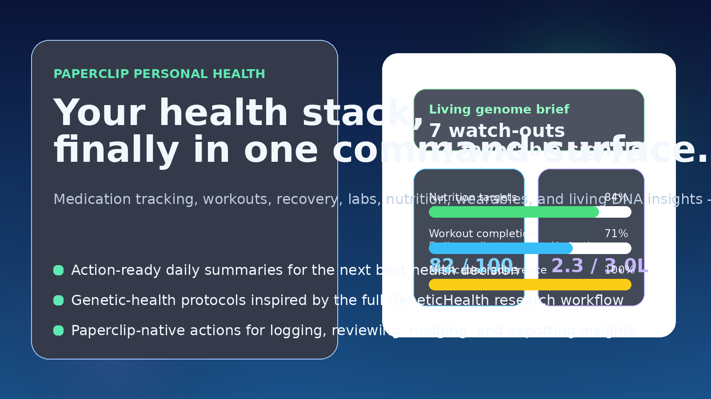
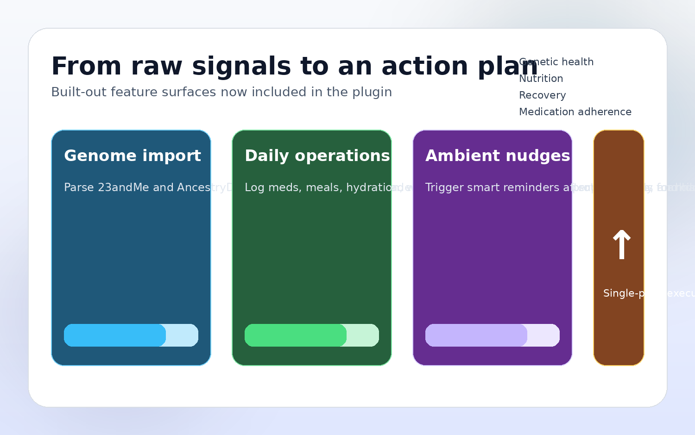

# Personal Health for Paperclip

> **Turn Paperclip into your personal health operating layer.**
>
> Track medication adherence, workouts, recovery, hydration, food, labs, appointments, supplements, and living genetic-health insights from one plugin instead of a dozen disconnected apps — with privacy modes, audit trails, and derived read models built in.



## Why this plugin exists

Most personal-health stacks break down because the data lives everywhere except where decisions happen.

- Meds are in a pharmacy portal.
- Workouts are in a wearable app.
- Labs are buried in PDFs.
- Bloodwork is hard to read without trend context.
- Nutrition tracking is tedious.
- Raw DNA exports are technically rich and practically useless.
- Genetics is easy to overinterpret when it is not tied back to labs and symptoms.

**Personal Health for Paperclip** brings those workflows into a single action surface so your AI can help you log, review, summarize, and follow through.

## What’s now included

### 1. Daily health operations
- Medication logging + refill tracking
- Symptom journaling + review summaries
- Appointment scheduling + prep checklists
- Lab result storage + trend review
- Habit tracking + streaks
- Supplement logging

### 2. Training, recovery, and wearables
- Workout plan creation + weekly programming
- Workout logging with cardio, strength, and wearable fields
- Workout summaries by date range and modality
- Recovery score tracking + recommendation engine
- Wearable sync status scaffolding for Apple Health, Garmin, Oura, WHOOP, and Strava

### 3. Nutrition and hydration
- Meal plan templates
- Meal logging + quick meals
- Macro and calorie target management
- Curated food search / lookup
- Hydration goals, intake logging, and progress checks

### 4. Labs, bloodwork, and genetic-health workflows inspired by `genetic.health`
This plugin carries over the most useful parts of the `genetic.health` product into a Paperclip-native command surface:

- Parse **23andMe** and **AncestryDNA** raw text exports
- Analyze bloodwork with biomarker trend review, category scores, biological age, and conservative action plans
- Cross-analyze genetics and bloodwork so DNA points to hypotheses, not conclusions
- Map curated variants into **evidence-graded health insights**
- Surface **nutrition, fitness, metabolic, cardiovascular, sleep, and pharmacogenomics** signals
- Compare reports over time
- Lookup any tracked **rsID** across imported reports
- Export clinician-ready markdown summaries instead of raw dumps
- Preserve **privacy mode vs living mode** DNA settings so data-control is treated as a product feature, not an afterthought



## Safety, privacy, and auditability

- Privacy mode reduces sensitive detail, suppresses ancestry inference, and minimizes variant-level retention when the user wants a stricter posture.
- Living mode keeps richer genetics analysis available, but sensitive exports still require explicit confirmation.
- Sensitive DNA exports and audit-log actions stay gated behind confirmation.
- Bloodwork and DNA outputs are decision-support summaries, not diagnoses or treatment instructions.
- Derived read models and projections keep the UI explainable by separating source records from computed summaries.
- Sensitive actions and policy changes are captured in the audit trail so users can review what happened and when.

## Read models and projections

The plugin exposes safe, derived views so the UI can stay explainable without reading raw state directly:

- `health.overview`
- `health.workouts.overview`
- `health.nutrition.overview`
- `health.labs.latest`
- `health.dna.latest`
- `health.reminders.pending`
- `health.privacy.status`

These views are backed by source records, then reduced into summary objects for fast review.

## Product positioning

This is not “yet another tracker.” It is a **decision layer**.

Use it when you want Paperclip to answer questions like:

- “What’s the most important health follow-up today?”
- “How has my training and recovery looked this week?”
- “Which meals are keeping me on target?”
- “How should I read my latest labs next to my DNA and training load?”
- “What does privacy mode hide?”
- “What changed in my latest lab and DNA projections?”
- “Do my latest DNA insights change how I think about nutrition, recovery, or pharmacogenomic watch-outs?”
- “What should I prep before tomorrow’s appointment?”

## Example actions

### Workouts
- `health.add-workout-plan`
- `health.log-workout`
- `health.get-workout-summary`
- `health.plan-weekly-workouts`

### Nutrition
- `health.add-meal-plan`
- `health.log-meal`
- `health.get-nutrition-summary`
- `health.log-hydration`
- `health.get-hydration`

### Bloodwork
- `health.add-lab-result`
- `health.get-lab-results`
- `health.review-lab-trends`
- `health.get-bloodwork-trends`
- `health.analyze-bloodwork`
- `health.get-bloodwork-category-scores`
- `health.calculate-biological-age`
- `health.get-bloodwork-action-plan`

### DNA
- `health.add-dna-report`
- `health.get-dna-insights`
- `health.get-dna-variant-detail`
- `health.lookup-rsid`
- `health.compare-dna-reports`
- `health.export-dna-insights`
- `health.get-dna-bloodwork-correlations`
- `health.get-dna-monitoring-plan`
- `health.get-dna-supplement-recommendations`
- `health.export-dna-comprehensive-report`

### Privacy and audit
- `health.update-privacy-settings`
- `health.get-privacy-status`
- `health.get-health-audit-log`
- `health.purge-health-audit-log`

### Daily operating layer
- `health.get-daily-summary`
- `health.send-hydration-nudge`
- `health.send-medication-reminder`
- `health.send-appointment-reminder`

## Example DNA import payload

```json
{
  "fileName": "ola-23andme.txt",
  "privacyMode": "privacy",
  "rawData": "# This data file generated by 23andMe..."
}
```

Use `privacy` when you want stricter retention and redaction. Use `living` when you want richer genetics analysis and are comfortable with a broader analysis posture.

The plugin will:
1. detect the source format,
2. parse the raw genotype rows,
3. match against the curated annotation knowledge base,
4. create evidence-labeled insights, and
5. make those insights available for lookup, export, and daily review.

## Ambient intelligence

The worker subscribes to `agent.run.finished` and can log nudges for:
- missed workouts,
- lagging hydration,
- no meals logged yet,
- upcoming appointments,
- missing medication logs,
- newly surfaced DNA insights.

This keeps the plugin proactive without becoming noisy.

## Safety framing

This plugin is designed for **education and operational awareness**.

It does **not**:
- diagnose disease,
- replace a clinician,
- recommend starting/stopping medication,
- make treatment decisions.

Genetic and bloodwork insights are framed as prompts for better conversations with qualified professionals, not as stand-alone treatment advice.

## Development

```bash
npm install
npm run plugin:build
npm run plugin:typecheck
npm test
npm run plugin:test
```

## Architecture snapshot

- **Paperclip worker plugin** built with `@paperclipai/plugin-sdk`
- **Instance-scoped state** for core health records
- **Curated DNA knowledge base** in `src/dna/annotations.json`
- **Action-driven interface** for logging, summaries, comparisons, exports, reminders, and privacy controls
- **Derived read models and projections** for overview, latest-lab, latest-DNA, reminder, and privacy views
- **DNA ↔ bloodwork correlation summaries** for conservative cross-analysis
- **Append-only audit trail** for sensitive actions and policy changes
- **Marketing assets** generated in-repo under `assets/readme/`

## Why teams and operators like it

Because it compresses a messy health stack into something actually usable:

- faster daily review,
- fewer missed follow-ups,
- less fragmentation,
- more context for your AI,
- more value from data you already own.

If you already use Paperclip as your command layer, this plugin turns it into a **personal health cockpit**.
